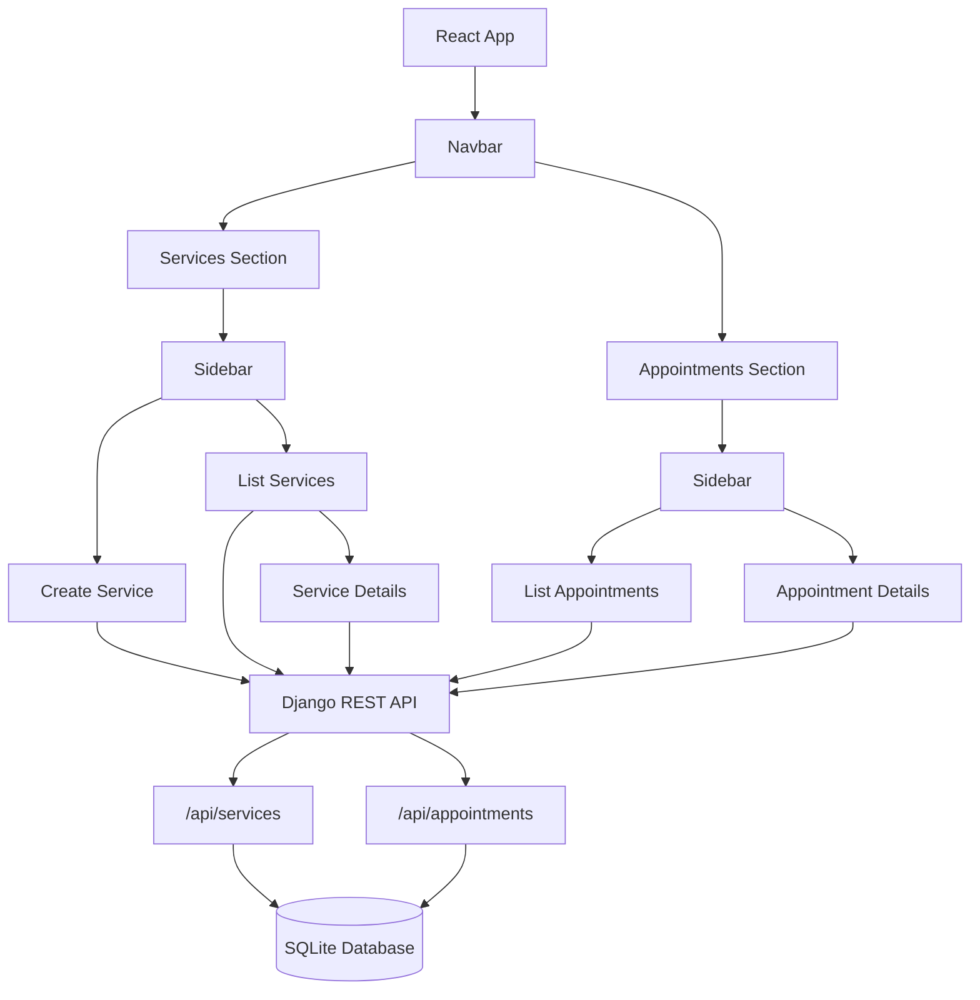

# VRIT Technology Interview — Technical Documentation

## 1. Overview

This project is a full-stack web application for managing **Services** and **Appointments**. It uses a **Django REST Framework** backend with a **SQLite** database, and a **React** frontend that consumes the API.

- **Backend:** Django + Django REST Framework
- **Database:** SQLite
- **Frontend:** React (Vite-style project structure)
- **Auth/Secrets:** Django secret key generated via Django's `secrets` utilities

## 2. Architecture



The frontend is organized by feature (Services, Appointments), each with its own list, create, and detail views, all sharing a common `Navbar` and `Sidebar` layout via `DashboardLayout`.

## 3. Data Model

### Relationship
- **Service  Appointment:** One-to-many relationship — a single `Service` can have multiple associated `Appointment` records.

### Ordering
Appointments (and likely other date/time-based records) use the following default ordering in their model `Meta` class:

```python
class Meta:
    ordering = ["-date", "-time"]
```

This orders records by most recent date first, then by most recent time within that date.

### Notes
- `created_at` / `updated_at` timestamp fields are **not yet implemented** on the `Service` and `Appointment` models (see [Backlog](#5-backlog--todo)).

## 4. Frontend Structure

```
frontend/
 src/
     components/
        Navbar.jsx
        Sidebar.jsx
        ServiceForm.jsx
        AppointmentForm.jsx
    
     layouts/
        DashboardLayout.jsx
    
     pages/
        services/
           ServicesPage.jsx
           ServiceDetailsPage.jsx
           CreateServicePage.jsx
       
        appointments/
            AppointmentsPage.jsx
            AppointmentDetailsPage.jsx
    
     api/
        services.js
        appointments.js
    
     App.jsx
     main.jsx
     index.css
```

**Structure notes:**
- `components/` — Reusable UI building blocks (nav, sidebar, forms).
- `layouts/` — Page-level layout wrappers (e.g., `DashboardLayout` wraps pages with `Navbar` + `Sidebar`).
- `pages/` — Route-level views, split by feature domain (`services`, `appointments`).
- `api/` — Thin API client modules per resource, responsible for calling the Django REST endpoints.

## 5. API Endpoints (Backend)

| Resource | Endpoint | Notes |
|---|---|---|
| Services | `/api/services` | CRUD for services |
| Appointments | `/api/appointments` | CRUD for appointments; linked to a service via one-to-many relationship |

> Endpoint details (methods, request/response schemas, filtering) are not yet fully documented and should be expanded once the API stabilizes.

## 6. Configuration & Secrets

- The Django **secret key** is generated using Django's built-in secrets utility (not hardcoded).
- Additional environment variables are planned but not yet finalized (see Backlog).

## 7. Things Remaining / TODO


The following items are known gaps to address in upcoming iterations:

- [ ] Add a service duration-based booking conflict check.
- [ ] Add pagination.
- [ ] Add automated backend tests.
- [ ] Improve the frontend filters and overall UI 


## 8. Suggested Next Steps

1. Add timestamp fields and generate corresponding migrations.
2. Introduce DRF pagination classes on list views.
3. Add throttling/rate-limiting classes to sensitive or high-traffic endpoints.
4. Set up structured logging (e.g., Python `logging` module with a rotating file or external log sink).
5. Write unit/integration tests for models, serializers, and views; add frontend component tests as needed.
6. Document full API contract (request/response shapes, status codes, error formats).
7. Improve Accesibility, loading and error handling in frontend with dedicated components.